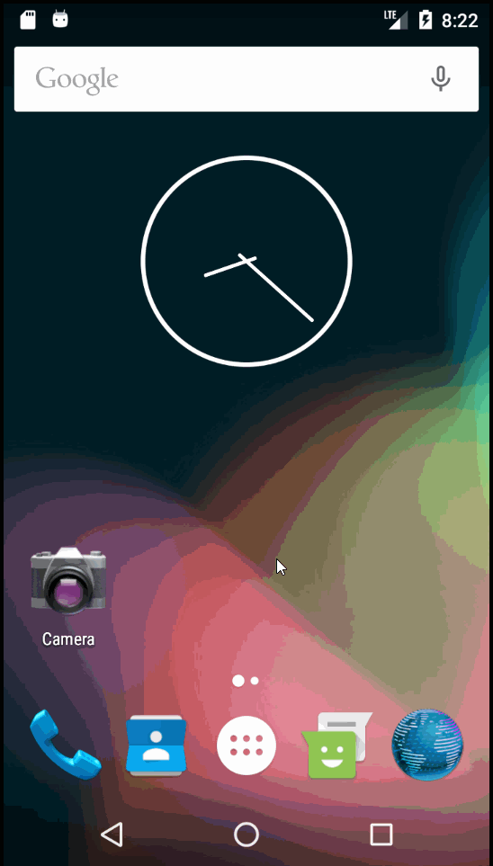

# Project 1 - *Simple Todo*

**Simple To do** is an android app that allows building a todo list and basic todo items management functionality including adding new items, editing and deleting an existing item.

Submitted by: **William Galindo**

Time spent: **5** hours spent in total

## User Stories

The following **required** functionality is completed:

* [X] User can **view a list of todo items**
* [X] User can **successfully add and remove items** from the todo list
* [X] User's **list of items persisted** upon modification and and retrieved properly on app restart

The following **optional** features are implemented:

* [X] User can **tap a todo item in the list and bring up an edit screen for the todo item** and then have any changes to the text reflected in the todo list

The following **additional** features are implemented:

* [X] Persist the todo items into SQLite instead of text file
* [X] Added support for selecting the priority of each todo item( and display them to user )
* [X] Tweak the style improving the UI, played with colors, images or backgrounds
* [X] Add support for selecting due dates for todo items(and display them to user)
* [ ] Add filter to sort items based on priority, date.
* [ ] Enable user to add todo scheduled task to their personal calendar.

## 1st Video Walkthrough with textFile storage

Here's a walkthrough of implemented user stories:

GIF created with [LiceCap](http://www.cockos.com/licecap/).

## 2nd Video Walkthrough with added features

Here's a walkthrough of implemented user stories:

GIF created with [LiceCap](http://www.cockos.com/licecap/).

## Notes

## License

    Copyright [yyyy] [name of copyright owner]

    Licensed under the Apache License, Version 2.0 (the "License");
    you may not use this file except in compliance with the License.
    You may obtain a copy of the License at

        http://www.apache.org/licenses/LICENSE-2.0

    Unless required by applicable law or agreed to in writing, software
    distributed under the License is distributed on an "AS IS" BASIS,
    WITHOUT WARRANTIES OR CONDITIONS OF ANY KIND, either express or implied.
    See the License for the specific language governing permissions and
    limitations under the License.
